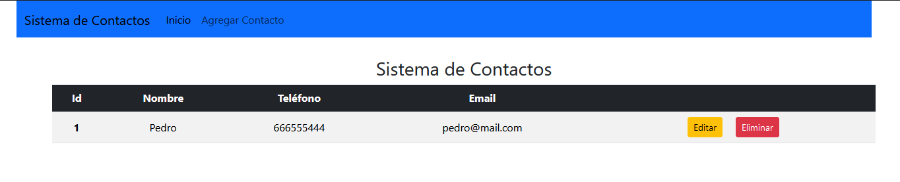
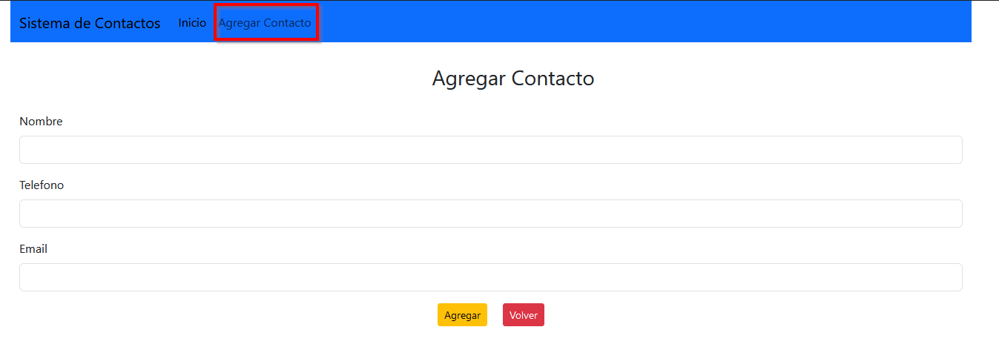
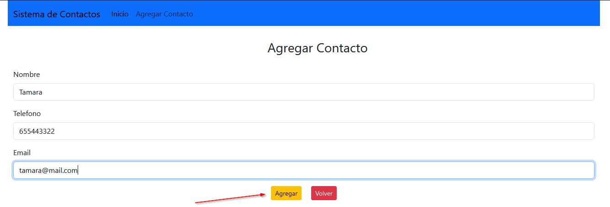
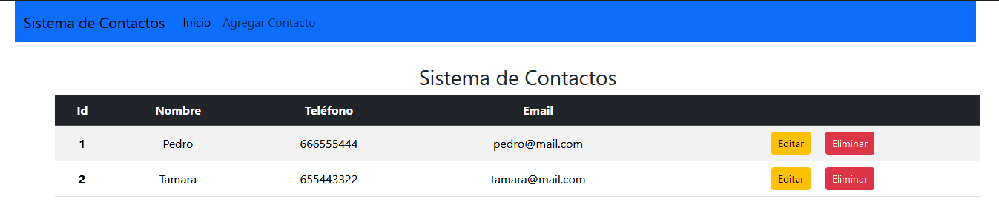
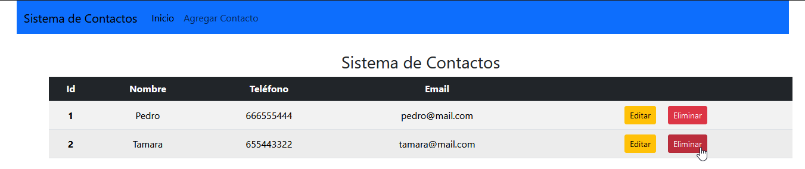
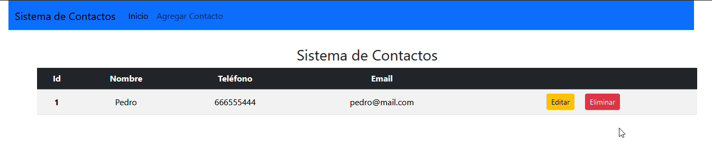

# Sistema de Contactos

Una sencilla aplicación para crear contactos y asignarles su nombre, email y teléfono.

Podemos editarlos y eliminarlos. Se guarda en una base de datos en MySQL.

Esta es la pantalla principal que tenemos

Si le damos en 'agregar contacto' nos muestra esta pantalla, donde generaremos un nuevo contacto.

Rellenamos los datos y ya nos genera automáticamente el id. Le damos a agregar para confirmar.

Cuando le damos a guardar, hace un refresh de la página principal y nos genera el contacto

Si pinchamos en eliminar, borramos el contacto

Y observamos que se ha eliminado el contacto y se hace un refresh de la página.

